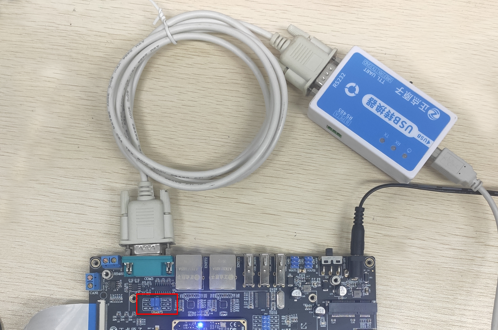
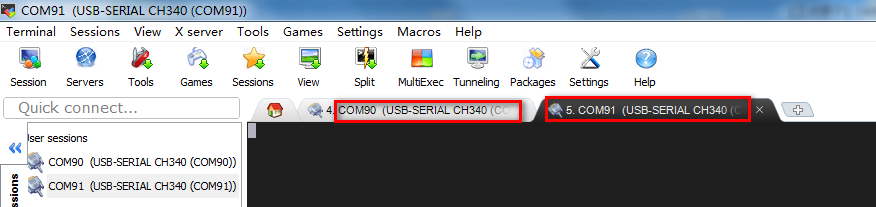
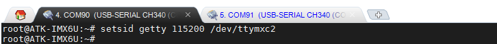
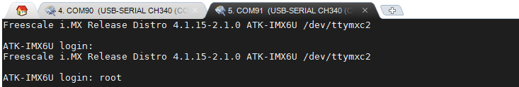
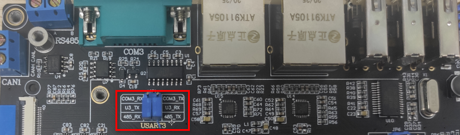

# 3.4 串口测试

## 3.4.1 RS232串口测试

底板上按键对应的管脚关系如下：

| ALPHA      | MINI   |
| ---------- | ------ |
| 本实验支持 | 本实验不支持，但是可以使用USB转换器模块的TTL UART直接接MINI板JP3处测试   |

测试前准备正点原子USB转换器和RS232转接头（或者直接用USB转公头RS232串口线）。如下图，下图准备的是正点原子的USB转换器。可以测试RS232与RS485等。（注：[测试RS485](#rs485串口测试)也是用这个模块。）


底板RS232接口与RS485接口的Tx与Rx是共用的，使用时需要使用跳线帽进行切换。RS232串口线的一头公头接到开发板底板的COM3接口处，另一头母头连接USB转换器再连接计算机的USB接口。测试前请将跳帽将U3_Tx与COM3_Rx连接，U3_Rx与COM3_Tx连接。连接方法示意及切换跳线帽的位置如下图。



在计算机的设备查看USB转换器的端口号。编者的端口号有两个，一个是开发板USB调试串口的，另一个就是USB转换器的端口号了。


在MobaXterm里连接COM91，和调试串口设置的方法一样，设置波特率为115200，8N1。可以看到COM90为编者的调试串口（USART1），COM91为开发板底板的COM3(USART3)串口。



在USART1串口调试终端COM90输入下面的指令，将RS232也设置成一个串口终端。
```c#
setsid getty 115200 /dev/ttymxc2
```



这样可以像调试串口一样输入登录用户名root，即可进入系统。这样能输入指令并返回结果，表明RS232串口正常。



## 3.4.2 RS485串口测试

与RS232测试方法一样，使用USB转换器测试RS485接口（或者用户手上有其他RS232转RS485的模块亦可）。测试前请将跳帽将U3_Tx与485_Rx连接，U3_Rx与485_Tx连接。切换跳线帽的位置如下图。



将USB转换器上的**RS485端口的A**用铜线接到**开发板RA485端口的A处**，USB转换器上的**RS485端口的B**用铜线接到**开发板RA485端口的B处**。
在计算机的设备查看USB转换器的端口号。编者的端口号有两个，一个是开发板USB调试串口的，另一个就是USB转换器的端口号了。

剩余测试步骤和[前小节](#rs232串口测试)的一样，不再重复累赘了。

