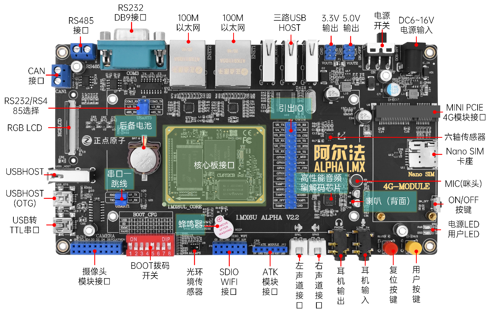
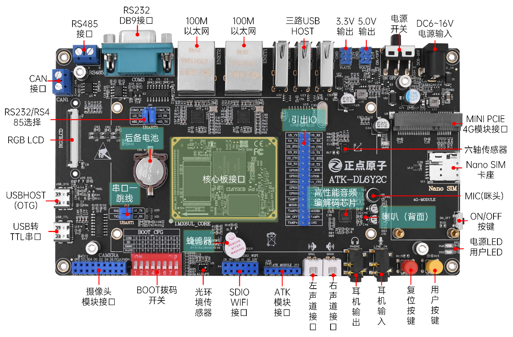
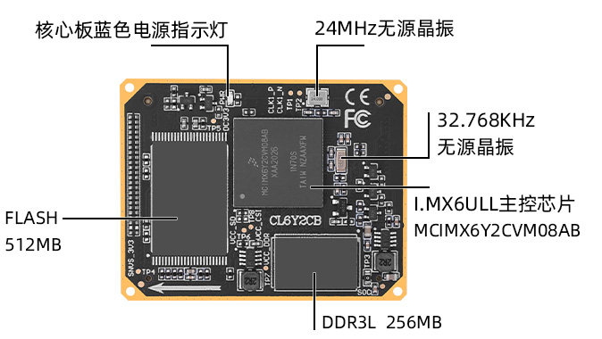
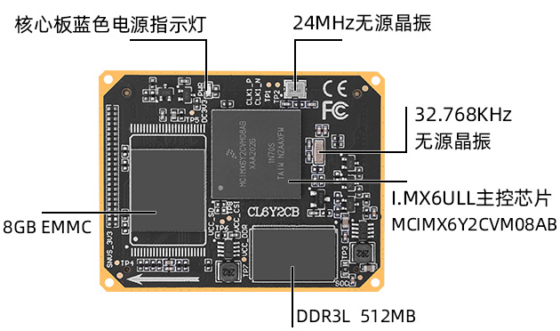

# 1.1 硬件资源简介

正点原子目前已经拥有多款 STM32、I.MXRT 以及 FPGA 开发板，这些开发板常年稳居淘宝销量冠军，累计出货超过 10W 套。这款 ALPHA 开发板，是正点原子推出的第一款 Linux 开发板，采用底板+核心板的形式。接下来我们分别介绍I.MX6U-ALPHA开发板的底板和核心板。

## 1.1.1 I.MX6U-ALPHA开发板底板资源简介

如何区分自己的底板？可以看正面或者背面底板上的丝印，如下图是V2.2版本。（版本丝印在背面）

V2.2大底板及以前的底板版本没有很大区别，都适用下图。

V2.4大底板版本如下图。与前面的版本采用了不同的PHY芯片，但是我们都做了软件兼容，用一套固件即可！以及由T口Mini USB换成了USB Type-C接口。音频由I2C2改版到了I2C1。为什么这么修改？支持不同的PHY，可以让批量的客户有多种选择，同时也为了支持这个国产的PHY。

如何区分自己的底板？可以看正面或者背面底板上的丝印，如下图是V2.4版本。（版本丝印在背面）

详细请看我们的《【正点原子】I.MX6U嵌入式Linux驱动开发指南V1.x.pdf》第五章I.MX6U-ALPHA开发板平台介绍的5.1~5.2.1小节。

+ 1 个核心板接口，支持 I.MX6UL/6ULL 等核心板
+ 1 个电源指示灯（蓝色）
+ 1 个状态指示灯（红色）
+ 1 个六轴（陀螺仪+加速度）传感器芯片，ICM20608
+ 1 个高性能音频编解码芯片，WM8960
+ 1 路 CAN 接口，采用 TJA1050 芯片
+ 1 路 485 接口，采用 SP3485 芯片
+ 1 路 RS232 串口（母）接口，采用 SP3232 芯片
+ 1 个 ATK 模块接口，支持正点原子蓝牙/GPS/MPU6050/手势识别等模块

## 1.1.2 I.MX6U-Mini开发板底板资源简介

如何区分自己的底板？可以看正面或者背面底板上的丝印，如下图是V1.7版本。（版本丝印在正面）

V1.8 Mini底板及以前的底板版本没有很大区别，都适用下图。

+ 1 个核心板接口，支持 I.MX6ULL 核心板。
+ 1 个电源指示灯（蓝色）。
+ 1 个状态指示灯（红色）。
+ 1 路 CAN 接口，采用 TJA1050 芯片。
+ 1 路 485 接口，采用 SP3485 芯片。
+ 1 个 ATK 模块接口，支持正点原子蓝牙/GPS/MPU6050/手势识别等模块。
+ 1 个摄像头模块接口。
+ 1 个 USB 串口，可用于代码调试。
+ 1 个 USB HOST 接口，用于 USB 主机通信。
+ 1 个有源蜂鸣器 。
+ 1 个 RS232/RS485 选择接口。
+ 1 个 TF 卡接口。
+ 1 个 10M/100M 以太网接口（RJ45）

详细请看我们的《【正点原子】I.MX6U嵌入式Linux驱动开发指南V1.x.pdf》第五章I.MX6U-ALPHA开发板平台介绍的5.1~5.2.1小节。

## 1.1.3 I.MX6U核心板资源

详细请看我们的《【正点原子】I.MX6U嵌入式Linux驱动开发指南V1.x.pdf》第五章I.MX6U-ALPHA开发板平台介绍的5.1.3小节。

